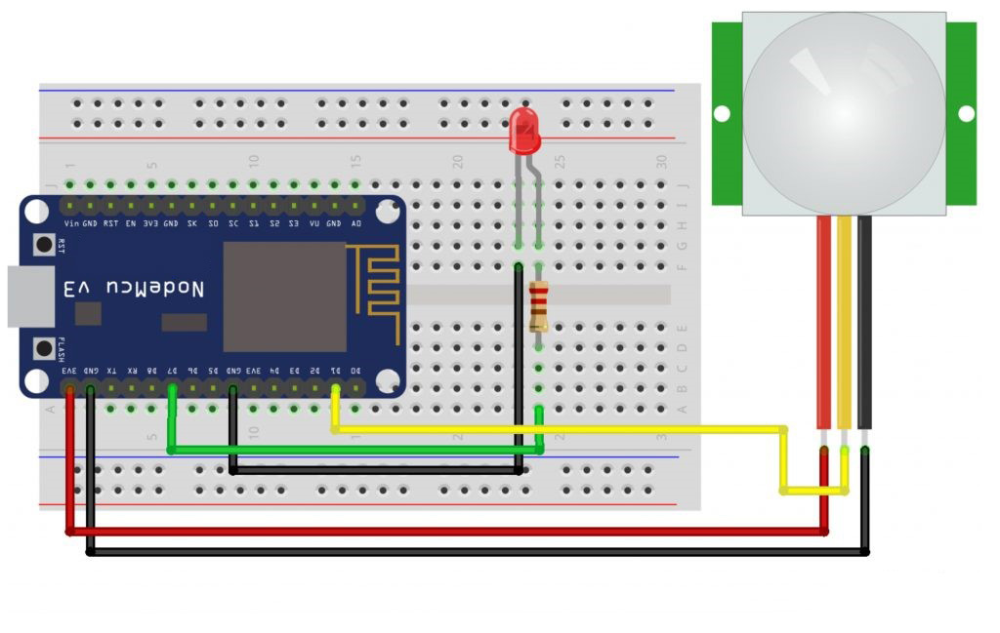
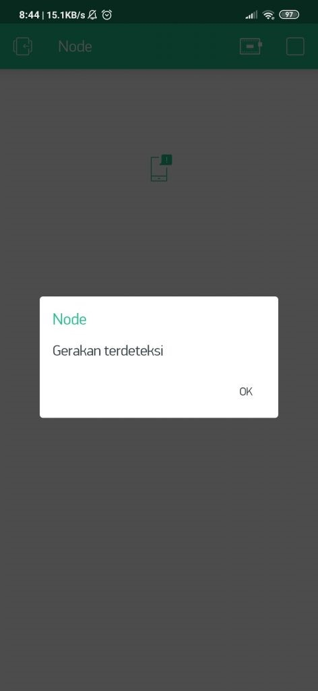

# Burglar Alarm Using Blynk and NodeMCU - IoT Project

This project implements a simple burglar alarm system using the NodeMCU (ESP8266) and Blynk. The system uses a PIR (Passive Infrared) sensor to detect motion and sends notifications to the Blynk app when motion is detected.

PIR (Passive Infrared), is a sensor that measures infrared radiation from an object. PIR works passively, therefore PIR only receives radiation and does not emit radiation. If this sensor is connected to an IoT device, the measurement data can be accessed from anywhere.

## Features

- Detect motion using a PIR sensor
- Send notifications to the Blynk app when motion is detected
- Control an LED based on motion detection

## Components Needed

- NodeMCU (ESP8266) = 1 unit;
- PIR Motion Sensor = 1 unit;
- LED = 1 unit;
- Resistors 220 ohm = 1 unit;
- Project Board / BreadBoard = 1 unit;
- connecting wires

# Schematic:

- Below you can see a schematic image to facilitate the wiring of cables from the microcontroller to devices, both input and output sensors:



## Installation

1. **Clone the repository:**

   ```sh
   git clone https://github.com/your-username/burglar_alarm.git
   cd burglar_alarm
   ```

2. **Install Libraries:**

   Make sure you have the following libraries installed in your Arduino IDE:

   - `ESP8266WiFi`
   - `BlynkSimpleEsp8266`

3. **Set Up Blynk:**

   - Create a new project in the Blynk app.
   - Add a notification widget to your project.
   - Copy the authentication token provided by Blynk and replace `"XXXX"` in the code with your token.

4. **Configure WiFi Credentials:**

   - Replace `"Veendy-Suseno"` and `"xxxxxxxxxx"` with your WiFi SSID and password.

5. **Upload Code:**

   - Open `code.ino` in Arduino IDE.
   - Select the correct board (NodeMCU 1.0) and port.
   - Upload the code to the NodeMCU.

## Code

```cpp
/*
  Burglar Alarm Using Blynk and NodeMCU
*/

#include <ESP8266WiFi.h>  // Pendeklarasian Library
#define BLYNK_PRINT Serial
#include <BlynkSimpleEsp8266.h>

char auth[] = "xxxxxxxxxx"; // Masukkan kode autentikasi disini
char ssid[] = "Veendy-Suseno"; // Nama WiFi
char pass[] = "xxxxxxxxxx"; // Password

#define ledPin D7  // Pemilihan Pin dan pendeklarasian variabel
#define pirPin D1
int pirValue;

void setup() { // Pengaturan Pin dan Variabel
  Serial.begin(115200);
  delay(10);
  Blynk.begin(auth, ssid, pass);
  pinMode(ledPin, OUTPUT);
  pinMode(pirPin, INPUT);
  digitalWrite(ledPin, LOW);
}

void loop() { // Perulangan Program
  getPirValue();
  Blynk.run();
  delay(1000); // Tambahkan delay untuk menghindari pembacaan sensor yang terlalu cepat
}

void getPirValue(void) { // Deklarasi Pembacaan PIR
  pirValue = digitalRead(pirPin);
  if (pirValue == HIGH) { // Bila ada gerakan terbaca
    Serial.println("Gerakan terdeteksi");
    Blynk.notify("Gerakan terdeteksi");
  }
  digitalWrite(ledPin, pirValue);
}

```

## Running the Application

- Power Up: Connect the NodeMCU to your computer or a power source.
- Monitor: Open the Serial Monitor in Arduino IDE to view debug messages. Check the Blynk app for notifications when motion is detected.

## Customization

- Modify GUI: Adjust Blynk app settings to fit your needs.

  - BLYNK Settings:
    Use the Notification type Widget Box
    <br/>
    Image of Notification Box Widget selection<br/>
  - Interface :
    <br/>
    Image of Blynk PIR Alarm Interface.<br/>

- Adjust Sensitivity: Change the PIR sensor's sensitivity as needed.
- Enhance Features: Add additional functionalities such as logging or integration with other smart home systems.

## Troubleshooting

- No Notifications: Ensure the Blynk app is properly configured and your NodeMCU is connected to WiFi.
- Sensor Issues: Verify the PIR sensor connections and ensure it is functioning correctly.

## Acknowledgments

- Blynk for providing a simple way to create IoT applications.
- ESP8266 and NodeMCU for their versatile microcontroller capabilities.
- The Arduino community for their support and resources.
  "# Burglar-Alarm-Using-Blynk-and-NodeMCU"

## Conclusion:

- In this project the PIR sensor is connected to the NodeMCU to detect movement. If someone enters a room that has a PIR sensor, the PIR sensor will provide an output which will be read by the NodeMCU which will then make the LED light up and provide a notification on the Blynk Application.
